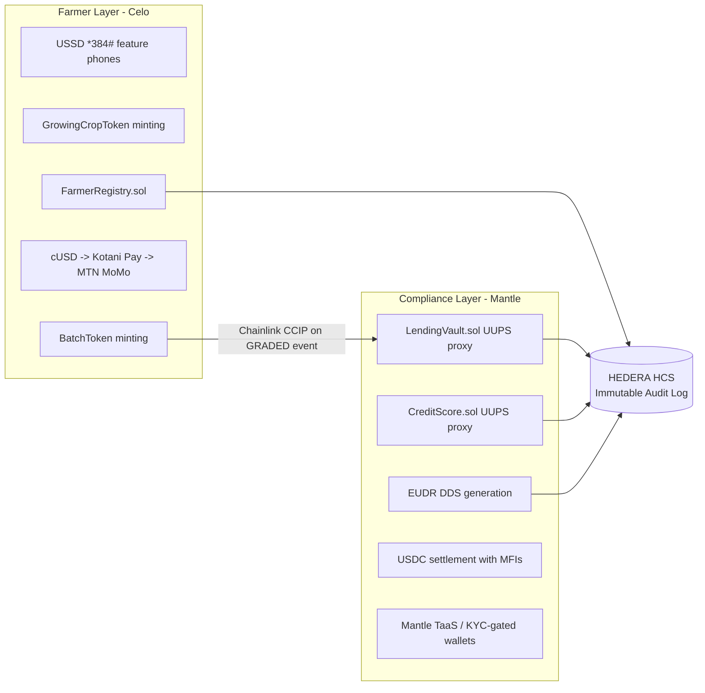

AsiliChain uses three chains with distinct, non-overlapping responsibilities. Celo handles all farmer-facing interactions: USSD, token minting, and mobile money settlement. Mantle handles all institutional operations: the LendingVault, credit scoring, EUDR DDS generation, and USDC settlement with MFI partners. Hedera HCS is the independent, append-only audit log that neither chain can modify and that both chains write to - the single source of truth for regulators and European buyers.

Figure 3: AsiliChain three-chain architecture - responsibilities and CCIP bridge point
