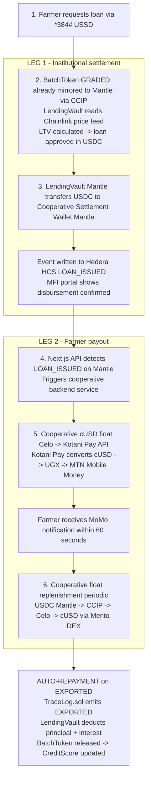

Loan disbursement uses a two-leg approach. Leg One: the LendingVault on Mantle approves the loan in USDC and transfers it to a designated cooperative settlement wallet on Mantle. This is the institutional settlement event that is recorded on Hedera HCS and is auditable by the MFI. Leg Two: the cooperative's backend service, triggered by the Mantle settlement event, calls Kotani Pay's API on Celo, converting the equivalent amount from the cooperative's Celo cUSD reserve to MTN Mobile Money for the farmer. The cooperative manages a float of cUSD on Celo that is periodically replenished from its Mantle USDC balance via a Chainlink CCIP transfer.

Figure 6: Revised two-leg loan disbursement flow resolving the USDC-to-MoMo gap
