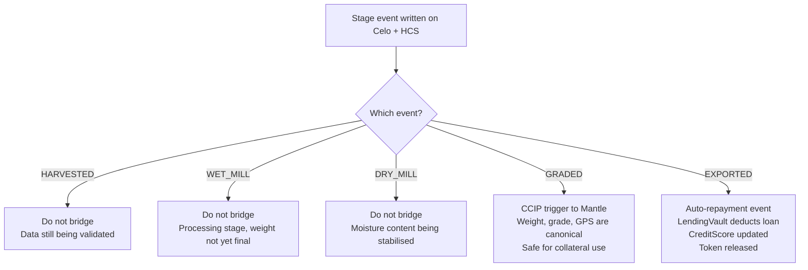

Not every on-chain event bridges to Mantle. Bridging too frequently adds cost and latency; bridging too late delays loan origination. The trigger point is the GRADED stage. At that moment, the physical coffee has been weighed and graded by the cooperative agent, the data is canonical and will not change, and the BatchToken is ready to serve as collateral. Before GRADED, the token is still being validated. After GRADED, the LendingVault on Mantle can safely accept the metadata as collateral input.

| Event | Chain Written | Bridge to Mantle? | Reason |
| --- | --- | --- | --- |
| HARVESTED | Celo + HCS | No | Data still being validated by cooperative agent. |
| WET_MILL | Celo + HCS | No | Processing stage, weight not yet final. |
| DRY_MILL | Celo + HCS | No | Moisture content being stabilised. |
| GRADED | Celo + HCS | YES - CCIP trigger | Weight, grade, and GPS are canonical. Safe for collateral use. |
| EXPORTED | Celo + Mantle + HCS | Auto-repayment | LendingVault deducts loan. CreditScore updated. Token released. |

Figure 7: CCIP bridge trigger matrix - only GRADED events bridge to Mantle
