Every serious technical partner - an MFI credit committee, a government ministry IT team, a European buyer's procurement officer - will ask what happens when a component fails. This section provides explicit answers. The system is designed with the assumption that any component can fail at any time, and that no single failure should halt the entire protocol or strand a farmer's funds.

```mermaid
flowchart TD
  ccip[Chainlink CCIP delayed or failed\nProbability: Low] --> m1[Mitigation\nRetry queue + manual trigger after 4h]
  pf[Price feed stale over 24h\nProbability: Very low] --> m2[Mitigation\nRevert new loans + 48h timelocked override]
  wf[Weather feed unavailable\nProbability: Low] --> m3[Mitigation\nConservative risk mode + pre-harvest freeze]
  hcs[Hedera HCS write fails\nProbability: Low] --> m4[Mitigation\nRetry up to 5x + pending off-chain log]
  kot[Kotani timeout\nProbability: Medium] --> m5[Mitigation\n30/60/120s retries + manual cash fallback]
  man[Mantle degraded\nProbability: Very low] --> m6[Mitigation\nRead-only mode + keep Celo operations]
  cel[Celo degraded\nProbability: Very low] --> m7[Mitigation\nQueue mints + retry guidance]
  ussd[USSD session drop\nProbability: High] --> m8[Mitigation\nStateless resume from draft checkpoint]
  key[Coop key compromise\nProbability: Low] --> m9[Mitigation\nRole split + emergency multisig pause]
```

| Component | Failure Mode | Probability | Mitigation | Farmer Impact |
| --- | --- | --- | --- | --- |
| Chainlink CCIP (Celo -> Mantle) | Bridge message delayed or failed | Low (CCIP SLA >99.9%) | Retry queue with exponential backoff. COOP_ROLE can manually trigger mirror write after 4-hour timeout. Alert fires to cooperative admin. | Loan origination delayed. No funds lost. BatchToken safe on Celo. |
| Chainlink Price Feed | Oracle price stale (>24hr without update) | Very low | LendingVault reverts all new loan originations. PRICE_FEED_ADMIN can set manual price override with 48-hour timelock. Event emitted and monitored. | New loans paused. Existing loans unaffected. Override logged on-chain. |
| Chainlink Weather Feed | Drought data unavailable | Low | System defaults to 'risk elevated' (conservative). GrowingCropToken loans frozen until feed recovers or admin overrides. | Pre-harvest loans paused in affected regions. BatchToken loans unaffected. |
| Hedera HCS write | HCS topic message fails | Low (HCS uptime >99.9%) | Write retried up to 5 times. If all retries fail, Supabase off-chain log captures event with pending flag. HCS write retried on next heartbeat. Celo record is canonical regardless. | Zero impact on farmer. Audit log has pending entries until HCS recovers. |
| Kotani Pay API | MoMo disbursement timeout | Medium (mobile money network variability) | Retry with 30s/60s/120s backoff. After 3 failures, cooperative agent notified via SMS. Manual disbursement fallback: agent pays farmer in cash against on-chain receipt. | Payment delayed up to 10 minutes. Manual fallback within 2 hours in extreme cases. |
| Mantle network | Chain unavailable or degraded | Very low | LendingVault read-only mode. No new loans. Existing collateral safe. Celo operations continue normally. Hedera HCS writes continue normally. | Loan origination paused. Traceability and payments continue on Celo. |
| Celo network | Chain unavailable or degraded | Very low | BatchToken minting queued in Supabase. USSD returns 'system busy' message. Farmer advised to retry in 30 minutes. | Batch submission delayed. Data safe in Supabase queue. |
| USSD session | Session drop mid-submission | High (network variability in rural Uganda) | USSD sessions are stateless. Incomplete submissions saved to Supabase draft. Agent can resume from last checkpoint on next session. | Farmer must resubmit final step only. No data lost. |
| Private key compromise | Cooperative custodial wallet compromised | Low | AGENT_ROLE and COOP_ROLE are separate. Compromise of agent key cannot drain LendingVault. Emergency pause function on LendingVault controlled by 3-of-5 multisig. | Protocol paused for affected cooperative pending key rotation. |

Figure 8: Failure modes matrix - nine components, failure modes, mitigations, and farmer impact
