The following metrics are projections, not actuals. They are grounded in cited comparable programmes in East Africa. Investors and partners should treat these as directionally informed targets, not guarantees. As real data is generated from Phase 1 onward, these projections will be replaced with measured outcomes.

```mermaid
xychart-beta
  title "Projected Performance Shift"
  x-axis [PAR30, PAR90, LoanDisbursementDays, DDSPrepDays]
  y-axis "Baseline vs Target" 0 --> 30
  bar [25, 15, 10, 10]
  bar [5, 2, 1, 1]
```

| Metric | Baseline (Comparable) | AsiliChain Target at Scale | Basis |
| --- | --- | --- | --- |
| Portfolio at Risk >30 days (PAR30) | 15-25% (un-collateralised agricultural MFI, SSA, CGAP benchmark) | < 5% | Auto-repayment on EXPORTED event eliminates voluntary non-payment. On-chain collateral enables recovery. Asset-backed microleasing in East Africa achieved 1% PAR30 (adOpes, 2024). |
| Portfolio at Risk >90 days (PAR90) | 8-15% (CGAP SSA benchmark) | < 2% | 90-day loans auto-close on EXPORTED event regardless of farmer action. Cooperative co-signature creates joint accountability. |
| Time to loan disbursement | 3-10 days (conventional cooperative lending in Uganda) | < 2 hours | LendingVault evaluation is automated. Two-leg settlement to MTN MoMo completes in < 60 seconds once approved. |
| Farmer net income per season | Baseline: ~$200/season (UCDA smallholder average) | Target: +35-60% | Combination of: (a) elimination of informal lender pre-sale discount (~15-25%), (b) premium pricing for EUDR-verified coffee (~15-25%), (c) reduced input cost through timely credit. |
| Export batch rejection rate (documentation) | 5-10% of EU-bound batches (industry estimate, EUDR-related, 2024-25) | < 0.5% | Every batch carries auto-generated, GPS-verified, cryptographically signed DDS. Documentation failure approaches zero. |
| DDS preparation time per shipment | 3-10 days (manual compilation by exporter, industry estimate) | < 30 minutes | DDS generated automatically from on-chain data. GPS check against Global Forest Watch API completes in seconds. |
| Loan approval rate vs. baseline | < 20% of smallholders have access to formal credit (Uganda, World Bank 2023) | Target: > 70% of registered cooperative members | On-chain GPS, weight, grade, and CreditScore data provides sufficient underwriting data. Collateral model removes the primary barrier. |
| Effective borrower APR | Informal lenders: 60-120% annualised (Uganda, estimated) | Target: 12-18% annualised | LendingVault rate set by governance. MFI pool competition reduces rate over time. Auto-repayment reduces lender risk premium. |

Figure 14: Projected impact metrics with East Africa comparables and AsiliChain targets - all figures are projections
