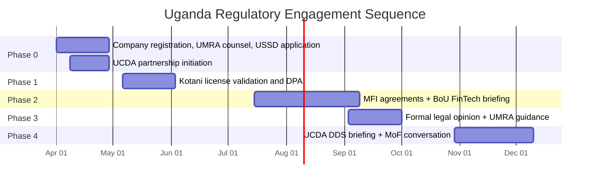

The following sequence maps regulatory engagement to the roadmap phases. No financial operations should begin before the relevant regulatory conversations have been had.

| Phase | Regulatory Action | Timeline | Responsible Party |
| --- | --- | --- | --- |
| Phase 0 | Register AsiliChain Ltd (Uganda) as a private limited company. Engage UMRA counsel on technology provider vs. lender classification. Apply for *384# USSD shortcode via UCC/Africa's Talking. | Weeks 1-4 | AsiliChain founders + Uganda counsel |
| Phase 0 | Initiate UCDA partnership conversation. Present protocol as EUDR compliance infrastructure. Request access to cooperative registry data for onboarding. | Weeks 2-4 | AsiliChain founders + UCDA |
| Phase 1 | Confirm Kotani Pay Uganda payment service licence status. Sign data processing agreement compliant with Uganda's Data Protection and Privacy Act 2019. | Weeks 5-8 | AsiliChain + Kotani Pay |
| Phase 2 | Formalise MFI partner agreements. Confirm UGAFODE / ENCOT / Pride Microfinance participation in LendingVault liquidity pool. Share protocol documentation with BoU FinTech team for informal review (not approval). | Weeks 15-22 | AsiliChain + MFI partners + Uganda counsel |
| Phase 3 | Commission formal legal opinion on LendingVault regulatory status from UMRA-familiar counsel. Submit to UMRA for guidance letter on technology provider classification before mainnet launch. | Weeks 23-26 | AsiliChain + Uganda counsel + UMRA |
| Phase 4 | Brief UCDA on first EUDR DDS generated from AsiliChain data. Provide UCDA with API access to aggregate traceability data. Initiate conversation with Ministry of Finance on blockchain collateral recognition under Ugandan secured transactions law. | Weeks 31-36 | AsiliChain + UCDA + Ministry of Finance |

Figure 16: Uganda regulatory engagement sequence mapped to roadmap phases
