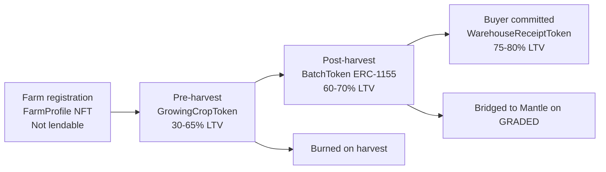

import TraceabilityExplorer from '@site/src/components/TraceabilityExplorer';

AsiliChain treats traceability as the root of collateral. Every stage below adds a new layer of evidence, until the farmer's crop can be financed, graded, warehoused, and ultimately settled against a buyer commitment.

<TraceabilityExplorer />

_Interactive traceability explorer spanning farm registration, crop growth, financing, harvest, warehousing, and buyer settlement._

## Collateral spectrum

Most agricultural lending tokenises assets at harvest. AsiliChain tokenises at every stage from farm registration to committed purchase order. The pre-harvest GrowingCropToken is the most transformative element: it enables a farmer to borrow in February for fertiliser and repay automatically in October when their batch is exported. The eight-month window is fully covered.

| Asset Type | Stage | Max LTV | Key Characteristic |
| --- | --- | --- | --- |
| FarmProfile NFT | Farm registration | Not lendable | Non-transferable identity. GPS polygon, tree count, variety. Foundation for all other tokens. |
| GrowingCropToken | Pre-harvest | 30-65% | Value scales with crop growth stage via Chainlink price feed. Burned on harvest. |
| BatchToken (ERC-1155) | Post-harvest | 60-70% | Physical coffee weighed and graded. Bridged to Mantle on GRADED event. |
| WarehouseReceiptToken | Buyer committed | 75-80% | BatchToken plus confirmed on-chain purchase order. Near cash-equivalent. |

Figure 9: Four-stage collateral spectrum