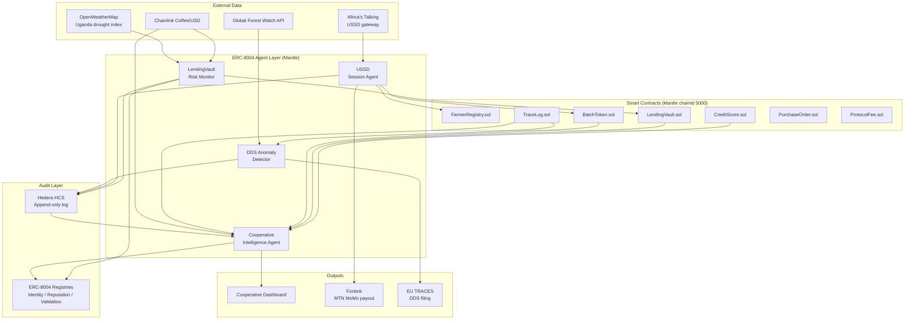

## Full Agent Layer Diagram



## Design Principles

**Agents read, contracts write.**
No agent can modify contract state directly. Agents
read from contracts via public view functions and
external APIs. They submit transactions through the
same access-controlled API layer that human operators
use. The on-chain security model is unchanged.

**Every decision is recorded before execution.**
An agent recommendation is written to Hedera HCS and
the ERC-8004 Validation Registry before any action
is taken. If the action fails, the recommendation
record still exists. This creates an audit trail of
intent, not just outcome.

**Agents have identities, not just addresses.**
Under ERC-8004, each AsiliChain agent has an NFT-based
identity on Mantle mainnet. Its decisions accumulate
against a reputation score. MFIs evaluating the protocol
can query an agent's historical recommendation accuracy
before trusting it with their capital.

**No autonomous high-stakes execution in Phase 1.**
Liquidation, forbearance approval, and emergency pause
all require human multisig in Phase 1 and Phase 2.
Agents provide the inputs to those decisions — they do
not make them unilaterally. Autonomous execution of
high-stakes actions is a Phase 3 capability, gated on
an established on-chain track record.

## ERC-8004 Identity Registry (Deployed)

AsiliChain deployed its own ERC-8004-compliant
IdentityRegistry on **Mantle Sepolia** (chain 5003):

```
Proxy:       0x62a6b58f8c3625F0c5f46D6C86A65595AA769C89
Implementation: 0x2E9D3EDf3406c4bd1a8f2CAE814c35D2294Fa02e
Owner:       0xB70f03dE20c9D4c90246c830F81D44f377A652C0
```

Registered agents:

| Agent | Agent ID | Token Owner |
|-------|----------|-------------|
| risk-monitor | 0 | deployer |
| anomaly-detector | 1 | deployer |

Reputation and Validation Registries are not yet deployed.
AsiliChain agents currently register on the Identity Registry
only — reputation will be earned on-chain as agents execute
cycles.

## Agent Technology Stack

| Layer | Technology |
|-------|-----------|
| Agent runtime | Python 3.12, CrewAI framework |
| LLM for reasoning | Configurable (MiniMax M1, Claude, GPT-4) |
| On-chain reads | viem.js public client, Mantle mainnet RPC |
| On-chain writes | API wallet relayer (same gas sponsorship as human ops) |
| ERC-8004 registration | ethers.js, Mantle mainnet |
| HCS writes | @hashgraph/sdk |
| Scheduling | Node.js cron (15-min / 30-min cycles) |
| External APIs | Chainlink, GFW, OpenWeatherMap, Africa's Talking |
| Agent endpoints | Next.js API routes at agents.asilichain.xyz |