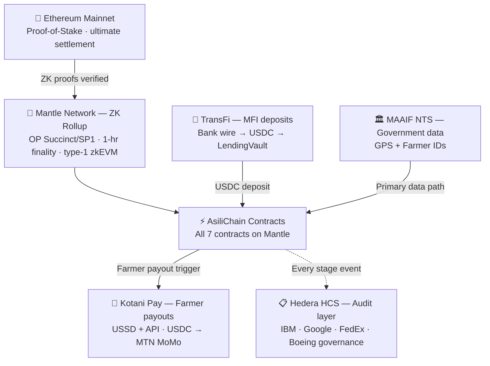

# Architecture Overview

## Single-Chain Design Rationale

All AsiliChain smart contracts deploy on Mantle. No cross-chain bridge. No CCIP. BatchToken and LendingVault share the same chain and communicate via direct contract calls.

| What was eliminated | What it cost | What was gained |
|--------------------|-------------|-----------------|
| Cross-chain bridge (previously considered) | High — bridge failures were the #1 complex failure mode | BatchToken → LendingVault: direct on-chain read |
| Second chain deployment | Medium — double audit scope, double RPC config | One audit · one explorer · one gas token |
| Annual cooperative gas budget | ~$307/yr with bridge fees | **~$7/yr — 97% reduction** |
