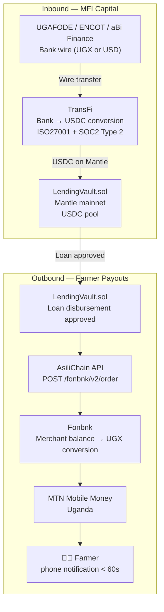

AsiliChain handles two distinct payment flows: outbound farmer payouts and inbound MFI deposits. Each uses a dedicated integration designed for its specific institutional and regulatory context.

## Payment Flow Overview



## Inbound: MFI Deposits via TransFi

MFIs wire in UGX or USD. TransFi converts to USDC and delivers to the LendingVault address on Mantle.

```
UGAFODE wires UGX 364,000,000 (~$100,000)
        ↓
TransFi FX: UGX → USD at live rate (fee: ~1.5–2.5%)
        ↓
TransFi: USD → USDC (1:1, no slippage)
        ↓
USDC delivered to LendingVault address on Mantle
        ↓
API calls LendingVault.deposit(amount, mfiAddress)
        ↓
MFI receives vault shares (ERC-4626 pattern)
MFI portal shows: "$97,500 deposited · Earning 8-10% APY"
Total elapsed: 1–24 hours (bank wire dependent)
```

**MFI entry cost:** ~1.5–2.5% (FX spread + TransFi fee). Payback at 8% yield: < 3 months.

## Outbound: Farmer Payouts via Fonbnk

BatchToken confirmed → Fonbnk API called → MTN MoMo credited.

Fonbnk uses a **merchant balance model**: we pre-deposit USDC to Fonbnk's Celo address via CCIP bridge, then trigger disbursements via API. No Celo contracts or wallets needed.

```typescript
// packages/api/lib/fonbnk.ts
export async function triggerFarmerPayout(params: {
  phone: string;        // +256XXXXXXXXX
  amount_usdc: number;  // from BatchToken value × LTV
  farmer_name: string;
  batch_id: string;
}) {
  const response = await fetch(`${process.env.FONBNK_BASE_URL}/v2/order`, {
    method: 'POST',
    headers: {
      'Content-Type': 'application/json',
      'X-Client-Id': process.env.FONBNK_CLIENT_ID!,
      'X-Signature': generateSignature(params, process.env.FONBNK_API_SECRET!),
    },
    body: JSON.stringify({
      paymentChannels: {
        deposit: { channel: 'merchant_balance', currencyType: 'merchant_balance', currencyCode: 'USD' },
        payout: { channel: 'mobile_money', currencyType: 'fiat', currencyCode: 'UGX', countryIsoCode: 'UG' },
      },
      recipient: { phone: params.phone, name: params.farmer_name },
      reference: params.batch_id,
    }),
  });
  return response.json();
}
```

**Retry logic:** Three retries at 30s / 60s / 120s intervals. On third failure, payment queued for manual review with full on-chain receipt preserved. Farmer can collect at cooperative office against batch receipt.

## Gas Sponsorship for Cooperative Wallets

Cooperative wallets pay Mantle gas (MNT) for contract interactions. At $0.002 per ZK proof:
- BatchToken mint: ~$0.002
- TraceLog stage update: ~$0.001
- LendingVault loan approval: ~$0.003
- **Annual cooperative cost: ~$7/year** for typical 500-batch-per-season cooperative

Gas is sponsored by the AsiliChain protocol wallet for farmer-initiated USSD sessions. Cooperative dashboards use cooperative-funded wallets.

## Auto-Repayment Settlement

On EXPORTED event, LendingVault executes the settlement atomically:

```solidity
function onExported(uint256 batchId, uint256 buyerPaymentUsdc) external {
    Loan storage loan = activeLoan[batchId];
    uint256 repayment = loan.principal + loan.accruedInterest;
    uint256 protocolFee = (repayment * PROTOCOL_FEE_BPS) / 10000; // 4%
    uint256 reserve = (repayment * RESERVE_BPS) / 10000;          // 1-2%
    uint256 netToFarmer = buyerPaymentUsdc - repayment - protocolFee - reserve;

    // Repay MFI pool
    _repayPool(loan.mfiAddress, repayment);
    // Collect protocol fee
    ProtocolFee(protocolFeeContract).collect(protocolFee);
    // Update credit score
    CreditScore(creditScoreContract).recordRepayment(loan.farmerId, +50);
    // Disburse net to farmer via Fonbnk (async, triggered by event)
    emit NetDisbursementReady(loan.farmerId, netToFarmer);
}
```
