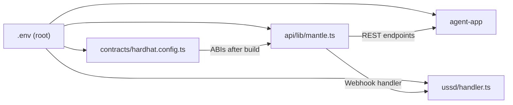

AsiliChain is a monorepo. All packages share the same Mantle target network and Hedera HCS topic configuration.

## Repository Layout

```
asilichain/
├── packages/
│   ├── contracts/              # Solidity smart contracts (Hardhat)
│   │   ├── contracts/
│   │   │   ├── FarmerRegistry.sol
│   │   │   ├── FarmAsset.sol
│   │   │   ├── BatchToken.sol
│   │   │   ├── TraceLog.sol
│   │   │   ├── LendingVault.sol
│   │   │   ├── CreditScore.sol
│   │   │   ├── PurchaseOrder.sol
│   │   │   └── ProtocolFee.sol
│   │   ├── scripts/
│   │   │   └── deploy.ts       # Strict deployment order (see Deployment Guide)
│   │   ├── test/
│   │   │   └── *.test.ts       # Hardhat + Chai test suite
│   │   ├── hardhat.config.ts
│   │   └── .env.example
│   │
│   ├── api/                    # Next.js API layer
│   │   ├── app/
│   │   │   └── api/
│   │   │       ├── batch/      # POST /batch/submit, /batch/stage-update
│   │   │       ├── eudr/       # POST /eudr/generate-dds, /eudr/verify-gfw
│   │   │       ├── farmers/    # POST /farmers/register, GET /farmers/:id
│   │   │       └── payments/   # POST /payments/farmer-payout
│   │   ├── lib/
│   │   │   ├── mantle.ts       # Viem client for Mantle mainnet
│   │   │   ├── hedera.ts       # HCS topic client
│   │   │   ├── kotanipay.ts    # Kotani Pay API wrapper
│   │   │   ├── transfi.ts      # TransFi API wrapper
│   │   │   ├── gfw.ts          # Global Forest Watch API
│   │   │   └── maaif.ts        # MAAIF NTS API wrapper
│   │   └── .env.example
│   │
│   ├── agent-app/              # Field agent Progressive Web App (Next.js)
│   │   ├── app/
│   │   │   ├── register/       # Farmer + farm GPS registration
│   │   │   ├── deliver/        # Batch submission flow
│   │   │   └── dashboard/      # Cooperative overview
│   │   └── public/
│   │
│   └── ussd/                   # Africa's Talking USSD handler
│       ├── handler.ts          # Session state machine
│       └── flows/
│           ├── deliver.ts      # *384# delivery flow
│           └── status.ts       # Loan status check
│
├── .env.example                # Root environment template
├── package.json                # Workspace root
└── turbo.json                  # Turborepo build config
```

## Key File Relationships



## Shared Environment Variables

```bash
# .env.example (root — copy to .env, never commit)

# Mantle
MANTLE_RPC_URL=https://rpc.mantle.xyz
DEPLOYER_PRIVATE_KEY=0x...
FARMER_REGISTRY_ADDRESS=0x...
BATCH_TOKEN_ADDRESS=0x...
TRACE_LOG_ADDRESS=0x...
LENDING_VAULT_ADDRESS=0x...
CREDIT_SCORE_ADDRESS=0x...
PURCHASE_ORDER_ADDRESS=0x...
PROTOCOL_FEE_ADDRESS=0x...

# Hedera HCS
HEDERA_ACCOUNT_ID=0.0.xxxxx
HEDERA_PRIVATE_KEY=...
HEDERA_TOPIC_ID=0.0.xxxxx

# Integrations
KOTANIPAY_API_KEY=...
KOTANIPAY_BASE_URL=https://api.kotanipay.io
TRANSFI_API_KEY=...
MAAIF_NTS_API_KEY=...
GFW_API_KEY=...
ALCHEMY_WEBHOOK_SECRET=...
PINATA_JWT=...

# Supabase (off-chain storage)
SUPABASE_URL=...
SUPABASE_SERVICE_ROLE_KEY=...
```
