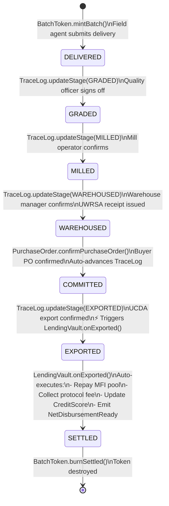

# BatchToken Lifecycle

Every BatchToken follows a defined lifecycle from mint to burn. Understanding this lifecycle is essential for building integrations, writing tests, and reasoning about collateral state at any point in time.

## Full Lifecycle Diagram



## Collateral State at Each Stage

| Stage | Has loan available? | LTV | Token transferable? |
|-------|-------------------|-----|-------------------|
| DELIVERED | Yes | 60% | Yes (if no active loan) |
| GRADED | Yes | 65% | Yes (if no active loan) |
| MILLED | Yes | 67% | Yes (if no active loan) |
| WAREHOUSED | Yes | 70% | Yes (if no active loan) |
| COMMITTED | Yes | 80% | **No** (PO locks transfer) |
| EXPORTED | No new loans | — | **No** (settlement in progress) |
| SETTLED | — | — | **Burned** |

## Loan State Machine (Parallel to Stage Machine)

```
No loan:
  DELIVERED → GRADED → MILLED → WAREHOUSED → COMMITTED
  BatchToken transferable. Farmer receives coffee payment at DELIVERED.

With loan originated at DELIVERED:
  DELIVERED (loan active, token locked)
    → GRADED (LTV increases, loan can be topped up)
    → MILLED
    → WAREHOUSED
    → COMMITTED (LTV increases to 80%)
    → EXPORTED (auto-repayment triggered)
    → SETTLED (loan closed, CreditScore +50, token burned)

With forbearance:
  EXPORTED event delayed (harvest failure)
    → 90-day forbearance granted by multisig
    → If export occurs within 90 days: normal SETTLED flow
    → If no export after 90 days: credit loss reserve absorbs, MFI protected
```

## What Cannot Happen

The contract architecture enforces these invariants:

- ❌ A BatchToken cannot go backward in stage (GRADED → DELIVERED is impossible)
- ❌ A locked BatchToken cannot be transferred or used as collateral for a second loan
- ❌ A token cannot be burned before SETTLED (burn requires VAULT_ROLE, only callable by LendingVault)
- ❌ A DDS cannot be generated for a token below GRADED stage
- ❌ Two PurchaseOrders cannot exist for the same BatchToken simultaneously

## Testing the Lifecycle

```typescript
// test/BatchTokenLifecycle.test.ts
describe('BatchToken full lifecycle', () => {
  it('should complete DELIVERED → SETTLED with auto-repayment', async () => {
    // 1. Register farmer
    await farmerRegistry.registerFarmer(farmer.address, 'UG-TEST-001', ...);

    // 2. Mint batch
    const tokenId = await batchToken.mintBatch(coop.address, 'UG-TEST-001', ...);

    // 3. Originate loan
    await lendingVault.originate(tokenId, { from: farmer.address });
    expect(await batchToken.hasActiveLoan(tokenId)).to.be.true;

    // 4. Advance through stages
    await traceLog.updateStage(tokenId, TraceStage.GRADED, evidenceCid);
    await traceLog.updateStage(tokenId, TraceStage.MILLED, evidenceCid);
    await traceLog.updateStage(tokenId, TraceStage.WAREHOUSED, evidenceCid);

    // 5. Confirm PO
    await purchaseOrder.createPurchaseOrder(tokenId, 'Test Buyer', 500e6);
    await purchaseOrder.confirmPurchaseOrder(0);

    // 6. Export — triggers auto-repayment
    await traceLog.updateStage(tokenId, TraceStage.EXPORTED, evidenceCid);

    // 7. Assert settlement
    expect(await creditScore.getScore('UG-TEST-001')).to.equal(550); // 500 + 50
    expect(await batchToken.exists(tokenId)).to.be.false; // burned
  });
});
```
