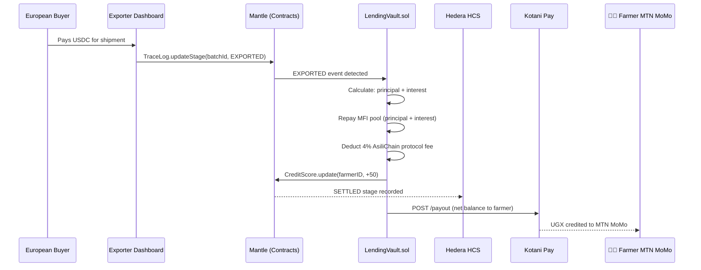

# Auto-Repayment

Auto-repayment is the mechanism by which AsiliChain loans repay themselves — triggered by the physical act of coffee being exported, with no collection agent, no manual payment, and no default risk from borrower non-cooperation.

## How It Works

## The Settlement Calculation

For a loan of $450 USDC at 16% APR over 6 months:

| Component | Amount (USDC) | Recipient |
|-----------|--------------|-----------|
| Principal repayment | $450.00 | LendingVault → MFI pool |
| Interest (8% MFI yield) | $18.00 | LendingVault → MFI pool |
| AsiliChain protocol fee (4%) | $9.00 | ProtocolFee.sol |
| Credit loss reserve (2%) | $4.50 | Smart contract buffer |
| Remaining from buyer payment | $518.50+ | Farmer via Kotani Pay |

## Why This Eliminates Default Risk

Traditional agricultural microfinance fails on collection — a borrower who has spent the loan cannot repay even if willing. AsiliChain's auto-repayment resolves this structurally:

| Traditional model | AsiliChain model |
|-------------------|-----------------|
| Seasonal repayment dependent on farmer finding cash | Repayment triggered by buyer's USDC payment |
| Collection agent required per borrower | Zero collection infrastructure |
| Default when harvest fails or price drops | LendingVault pauses on drought risk signal; forbearance built in |
| No consequence for strategic default | CreditScore −100; future loans blocked protocol-wide |

## Forbearance Protocol

If a harvest fails or market conditions prevent export:

1. Cooperative triggers LendingVault forbearance request
2. 3-of-5 multisig governance vote required to approve
3. 90-day extension granted — no penalty during forbearance
4. If batch is subsequently exported, auto-repayment executes normally
5. If loss is confirmed total, credit loss reserve absorbs shortfall; MFI pool protected up to reserve threshold

## CreditScore Effect

Every auto-repayment that executes successfully adds +50 to the farmer's on-chain CreditScore. After three successful loan cycles, a farmer at 650 qualifies for a higher LTV tier and larger loan ceiling — creating a path from subsistence-scale to cooperative-scale financing.
