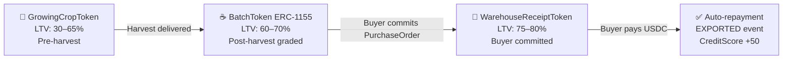

:::note[Credit is optional]
Not every farmer wants or needs a loan. Farmers who are economically self-sufficient benefit from AsiliChain — faster payment, EUDR compliance, price transparency — without touching the lending product.
:::

## Two Farmer Profiles

| Profile | What they use | What they gain |
|---------|--------------|----------------|
| **Credit user** | GrowingCropToken or BatchToken as collateral | Working capital at 14–18% APR instead of 60–120% informal lender rates |
| **Self-sufficient** | No credit facility engaged | 60-second MTN MoMo payment · EUDR DDS access · real-time market price · on-chain credit history begins building |

## The Four-Stage Collateral Spectrum

## Interest Rate Structure

| Component | Rate | Recipient |
|-----------|------|-----------|
| Borrower APR (gross) | 14–18% | Total charged |
| MFI liquidity yield | 8–10% | MFIs funding the pool |
| AsiliChain margin | 4% (fixed at launch) | AsiliChain treasury |
| Credit loss reserve | 1–2% | Smart contract buffer |

**Context:** Uganda informal agricultural credit APR is 60–120%. EthicHub (closest comparable, Latin America/Africa) achieves 12–15% gross across 10,000+ farmers since 2018.

## CreditScore.sol

- **Start:** 500
- **On-time repayment:** +50
- **Default:** −100
- **Portable** across cooperative memberships
- **Public** — any MFI can query before approving
- **Permanent** — cannot be deleted or altered

Self-sufficient farmers also build CreditScore through on-time delivery records and cooperative standing — creating future optionality without requiring a loan today.
