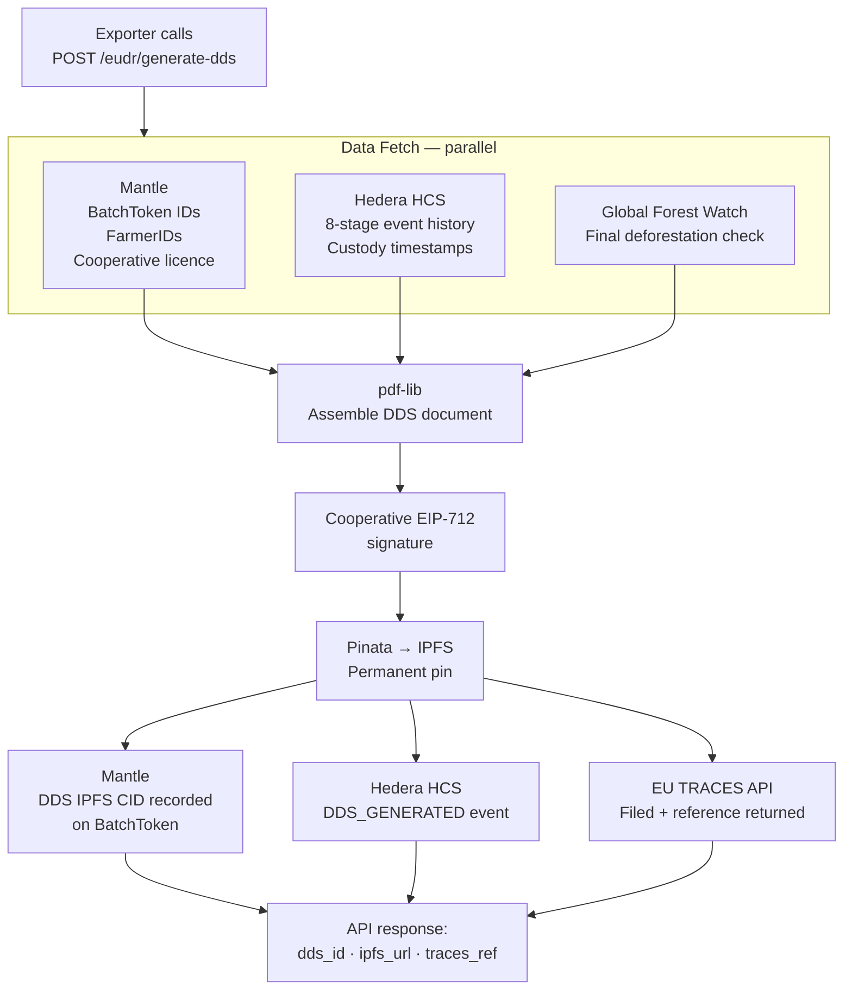

The Due Diligence Statement pipeline generates, signs, stores, and files EUDR-compliant documents automatically from normal AsiliChain operations. No manual input from the exporter beyond initiating the request.

## Pipeline Overview

## Step-by-Step

### Step 1: Data Fetch (parallel, ~2–4 seconds)

The pipeline fetches from three sources simultaneously:

- **Mantle:** All BatchToken metadata for the shipment — farmer IDs, GPS hash, grade, weight, cooperative licence number
- **Hedera HCS:** Complete stage history for each batch — timestamps, actor wallet addresses, Mantle tx hashes
- **GFW:** Final satellite deforestation check against December 2020 baseline for each farm polygon

### Step 2: Document Assembly

`pdf-lib` assembles the PDF DDS document. The document includes:
- All farm GPS references (IPFS CID links to raw GeoJSON — not embedded in PDF)
- Complete 8-stage custody chain
- GFW verification status and timestamp
- Cooperative EIP-712 signature placeholder

### Step 3: Cooperative Signature

The cooperative's wallet signs the DDS hash using EIP-712 structured data signing. This provides:
- Cryptographic proof of cooperative authorization
- Non-repudiation — the cooperative cannot deny having filed the DDS
- Verifiability by EU customs without contacting AsiliChain

### Step 4: IPFS Pinning

Pinata pins the signed DDS to IPFS. The IPFS CID is recorded:
- As a field in the DDS response
- On the BatchToken metadata on Mantle
- In a Hedera HCS message for the DDS_GENERATED event

### Step 5: EU TRACES Filing

The pipeline calls the EU TRACES API with the DDS data. TRACES returns a reference number that the cooperative uses for export documentation.

:::caution[TRACES API access required]
The EU TRACES API requires operator registration. This is the exporter's responsibility — AsiliChain calls the API on their behalf but the licensed exporter (Department of Coffee Development, MAAIF) must hold the TRACES account. Begin TRACES registration at the same time as MAAIF NTS API access.
:::

## Timing

| Step | Duration |
|------|---------|
| Data fetch (parallel) | 2–4 seconds |
| Document assembly | 1–2 seconds |
| EIP-712 signature | < 1 second |
| IPFS pinning | 3–8 seconds |
| TRACES filing | 5–15 seconds |
| Mantle + HCS record | 2–5 seconds |
| **Total** | **~15–35 seconds** |

## Error Handling

| Failure | Behaviour |
|---------|-----------|
| GFW API timeout | Retry 3×. If unresolvable, DDS blocked — farm must be manually reviewed |
| TRACES API unavailable | DDS generated and pinned to IPFS. TRACES filing retried on schedule. Exporter notified. |
| Batch not GRADED | API returns `BATCH_NOT_ELIGIBLE` — DDS requires GRADED status |
| Farm not deforestation-free | API returns `GFW_CHECK_FAILED` — batch blocked from this shipment, flagged for review |
