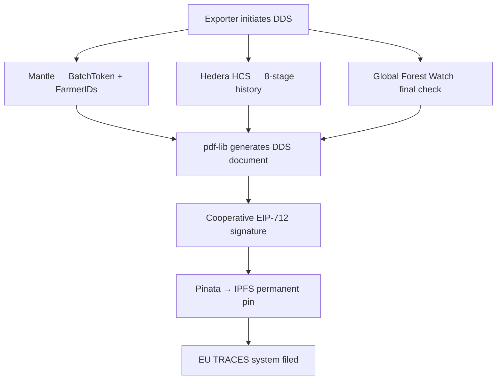

# EUDR Compliance

## Why This Is Existential for Uganda's Coffee Sector

The EU Deforestation Regulation (EU 2023/1115) enforcement deadline is **December 30, 2026**. Uganda exports approximately 70% of its coffee to Europe. The entire sector faces a market access cliff.

:::danger Penalties for non-compliance
- Fines up to **4% of annual EU turnover** per member state
- **Confiscation** of goods and revenue
- **Exclusion** from future import authorisation and public procurement
:::

## How AsiliChain Eliminates the Risk

EUDR compliance is a byproduct of AsiliChain's normal operations. No separate documentation process. No consultant fees.

| EUDR Article 4 requirement | AsiliChain implementation |
|---------------------------|--------------------------|
| GPS to 6 decimal places | Native GeoJSON from agent app or MAAIF NTS. No conversion. |
| Polygon for farms > 4 hectares | Agent walks perimeter. App auto-closes polygon. |
| Deforestation-free since Dec 2020 | Global Forest Watch API checked at registration and DDS generation. |
| No mass-balance blending | BatchToken links every lot to specific farmer IDs. Architecturally impossible to blend. |
| DDS filed before EU entry | Auto-generated on GRADED status. Signed, IPFS-pinned, TRACES-ready. |
| Records kept 5 years | Hedera HCS, Mantle, and IPFS are permanent by design. |

## DDS Generation Pipeline

