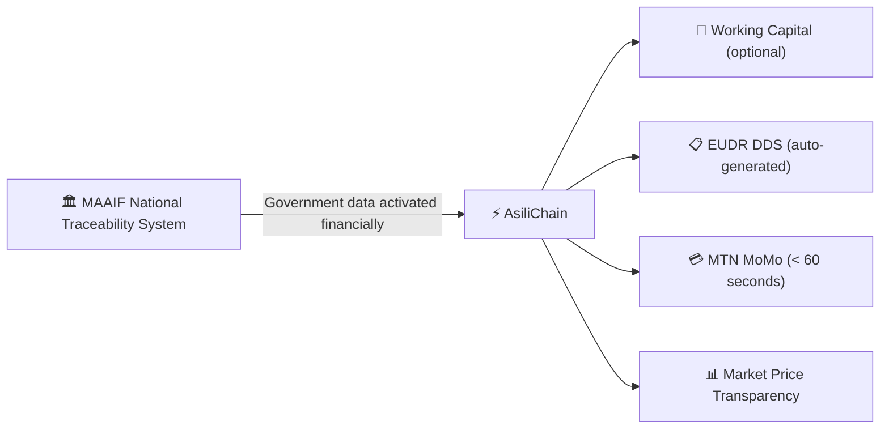

:::note[Core insight]
AsiliChain turns Uganda's government coffee farmer registry into credit infrastructure — so the GPS coordinates collected for EU compliance also unlock a farmer's working capital loan. For farmers who are financially self-sufficient, it delivers faster payment, EUDR compliance, and market price transparency without requiring them to borrow anything.
:::

## The Strategic Insight

Two forces are creating an opening simultaneously. The **EU Deforestation Regulation** enforcement deadline of December 30, 2026 requires GPS-verified compliance documents for every European shipment. **Uganda's government** is investing USD 9.15 million to GPS-map every coffee farmer through the National Traceability System.

AsiliChain does not rebuild what the government is building. It reads from it.

> The same data that satisfies a European auditor unlocks a farmer's working capital loan — and delivers 60-second payment to every farmer, loan or no loan.

## What AsiliChain Is

An **Ethereum L2 application** built on **Mantle Network** — the world's largest ZK rollup by TVL (>$2B). Mantle completed its transition from optimistic to ZK rollup architecture in September 2025 via OP Succinct/SP1, achieving 1-hour transaction finality at $0.002 proving cost per transaction.

