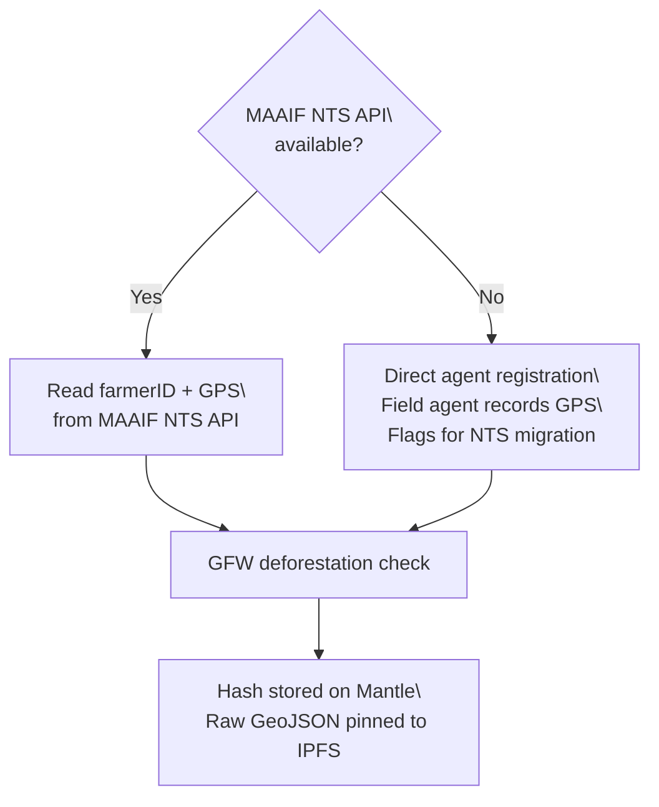

AsiliChain does not build a parallel farmer database. It reads from Uganda's own National Traceability System — turning a compliance dataset the government is already funding into financial infrastructure.

## The MAAIF Investment

Uganda's Ministry of Agriculture, Animal Industry and Fisheries committed **USD 9.15 million** to the National Traceability System (NTS). The NTS assigns every coffee farmer:

- A **unique national farmer ID**
- A **GPS polygon** of their farm boundary (to 6 decimal place precision)
- A **UCDA cooperative membership** record
- A **cultivar and acreage** record

This data satisfies EUDR Article 4 requirements. AsiliChain reads it via the MAAIF NTS API rather than collecting it independently.

## Why This Matters

| Approach | What it means |
|----------|---------------|
| **AsiliChain reads from government** | Government retains control. Data sovereignty is preserved. Revoking API access closes AsiliChain's primary data path. |
| **No parallel database** | AsiliChain cannot create a shadow copy of farmer data without government knowledge. Privacy risk is bounded. |
| **Government-backed credibility** | EU auditors trust MAAIF data more than a startup's proprietary database. The GPS record carries sovereign weight. |
| **Reduced AsiliChain KYC burden** | MAAIF has already KYC'd every farmer with a national ID card and physical farm visit. |

## Primary and Fallback Paths



**Primary path:** MAAIF NTS API returns farmer record in < 2 seconds. AsiliChain hashes the GPS polygon, stores hash on Mantle, pins raw GeoJSON to IPFS with access controls.

**Fallback path:** Field agent uses the AsiliChain agent app to GPS-walk the farm boundary manually. Record is stored identically but flagged for NTS reconciliation during the next MAAIF sync. Protocol continues without interruption.

## MAAIF NTS API Integration

```bash
GET https://nts.maaif.go.ug/api/v1/farmers/{national_farmer_id}
Authorization: Bearer {MAAIF_API_KEY}
```

Response includes:
```json
{
  "farmer_id": "UG-KAS-2024-001234",
  "cooperative_id": "COOP-MBALE-001",
  "ucda_licence": "UCDA-COOP-00889",
  "farm_boundary": {
    "type": "Polygon",
    "coordinates": [[[ 34.1772, 1.0656 ], ...]]
  },
  "area_hectares": 2.4,
  "cultivar": "Robusta",
  "registration_date": "2024-03-01"
}
```

## First Action: NTS API Access

:::danger[This is the first action before any code is written]
Before Phase 1 development begins, the AsiliChain founding team must initiate the MAAIF NTS API access conversation. This is a government partnership conversation — not a technical task. Contact: MAAIF Director of Agricultural Infrastructure. Timeline: 4–8 weeks for approval.
:::

The NTS API conversation must be initiated before Phase 1 mainnet because the primary registration path depends on it. The fallback path works — but onboarding 200 farmers manually is significantly more expensive than via API.
