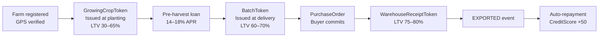

AsiliChain activates Uganda's government coffee farmer data financially, turning compliance records into credit infrastructure without building a parallel database.

## The Core Loop

<figure>
  
  <figcaption>The Core Loop — from farm registration to mobile money payout in four steps</figcaption>
</figure>

## Four Outputs for Every Farmer

Every batch delivered through AsiliChain produces four outputs automatically, regardless of whether the farmer has a loan:

| Output | How it works | Who benefits |
|--------|-------------|-------------|
| **60-second payment** | Fonbnk converts merchant balance to UGX and credits MTN MoMo | Every farmer |
| **EUDR compliance** | GPS + stage data auto-generates a DDS at export time | Cooperatives, exporters |
| **Market price transparency** | Chainlink oracle prices are visible to the cooperative dashboard | Every farmer |
| **On-chain credit history** | CreditScore begins building from first delivery, usable for future loans | Every farmer |

## The Eight Custody Stages

Every BatchToken moves through eight defined stages, each recorded on Hedera HCS:

| Stage | Action | Who records |
|-------|--------|------------|
| 1. REGISTERED | Farm GPS mapped, farmer ID verified | MAAIF NTS / agent |
| 2. DELIVERED | Coffee weighed and submitted at collection point | Field agent via USSD |
| 3. GRADED | Quality assessment (moisture, screen size) | Cooperative quality officer |
| 4. MILLED | Coffee processed (hulled, cleaned, sorted) | Mill operator |
| 5. WAREHOUSED | Physical coffee stored under warehouse receipt | Warehouse manager |
| 6. COMMITTED | Buyer PurchaseOrder confirmed on-chain | Cooperative / exporter |
| 7. EXPORTED | Shipment leaves Uganda | [Department of Coffee Development export permit](/overview/export-certification) confirmed by exporter |
| 8. SETTLED | Buyer USDC payment received → loan auto-repaid | LendingVault auto-executes |

## Credit Flow (Optional)

For farmers who want working capital:

Credit is **optional**. Farmers who do not want loans still complete the same delivery and receive the same 60-second payment and compliance data.
