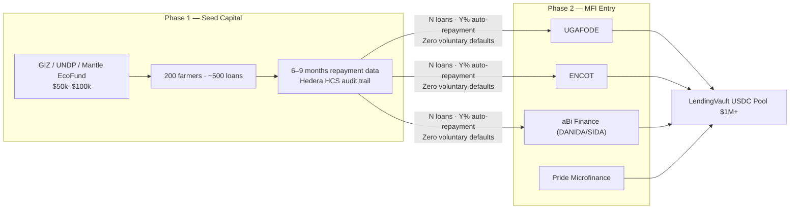

# MFI Acquisition Strategy

:::info The cold start problem — and how to break it
MFIs will not commit capital to a protocol with no track record. AsiliChain cannot demonstrate a track record without MFI capital. Solution: seed Phase 1 with grant capital, earn repayment data, walk into Phase 2 MFI meetings with verified performance.
:::

## The Warehouse Lending Model

## Target MFI Sequence

| MFI | Why first | Timing |
|-----|-----------|--------|
| UGAFODE | Agricultural cooperatives, Western Uganda, UMRA-licensed | Phase 2 Week 21 |
| ENCOT | Rural presence, group lending experience | Phase 2 Week 24 |
| aBi Finance | DANIDA/SIDA-backed, committed to Uganda EUDR national action plan | Phase 2 concurrent |
| Pride Microfinance | Uganda's largest UMRA-licensed MFI, national scale | Phase 2 Week 28 |
| Rafiki Microfinance | Kenya Phase 3 expansion | Phase 3+ |

## EthicHub Benchmark

EthicHub is the closest structural precedent: on-chain agricultural lending since 2018, $5M deployed to 10,000+ farmers in 6 countries, crowd collateral model.

**AsiliChain's structural advantages:**
- Collateral is GPS-verified physical coffee (not speculative ETHIX tokens that can fall independently of crop performance)
- Auto-repayment on EXPORTED event (not manual seasonal collection)
- Government data integration (MAAIF NTS)
- EUDR DDS auto-generation (EthicHub has no compliance function)
- No native speculative token
