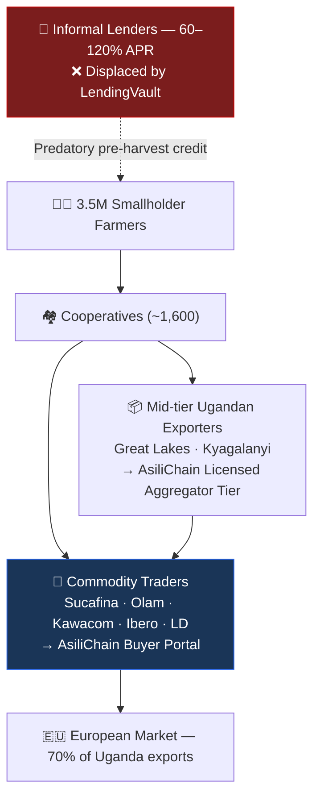

:::caution[Strategic reality]
Ten companies export 70% of Uganda's coffee. They are overwhelmingly multinational commodity traders. Understanding this reframes AsiliChain's buyer acquisition strategy entirely — the primary buyer audience is not a specialty roaster in Amsterdam. It is Sucafina, Olam, and Louis Dreyfus.
:::

## The Export Concentration

| Exporter | Market share | Ownership | EUDR exposure |
|----------|-------------|-----------|---------------|
| Ugacof | Largest share | Ugandan-headquartered | Very high |
| Sucafina | ~12.67% | Swiss commodity trader | Very high |
| Olam Uganda | ~8.64% | Singapore-listed Olam International | Very high |
| Kawacom | ~7.86% | Ecom Agro Industrial Corporation | Very high |
| Ibero Uganda | ~7.33% | Haroca Holding AG (Switzerland) | Very high |
| Touton Uganda | ~7.18% | Touton Far East Pte Ltd | High |
| Louis Dreyfus | ~6.81% | LDC Participations BV (Netherlands) | Very high |

Italy receives 39% of Uganda's European coffee exports. **The commodity trader files the DDS** — not the Italian roaster.

## Three Categories of Middlemen

| Category | Role | AsiliChain strategy |
|----------|------|---------------------|
| International commodity traders | Aggregate, ship, finance, access EU markets | **Partner** — verified supplier API for EUDR/ESG |
| Mid-tier Ugandan exporters | Bridge cooperatives and commodity traders | **Licensed aggregator tier** — 0.5% fee on every transfer |
| Local informal lenders | Pre-harvest credit at 60–120% APR | **Displaced** — LendingVault replaces their function |
