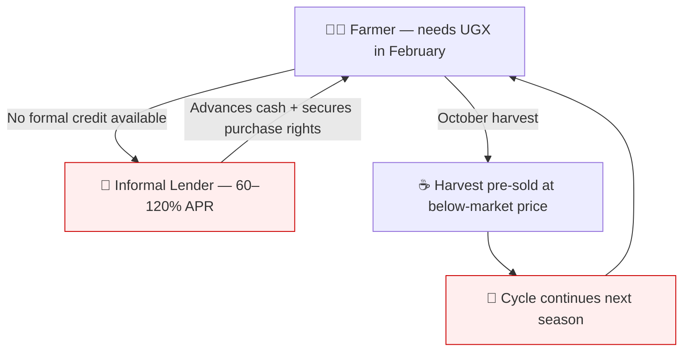

# The Problem: Structural Failures in Uganda's Coffee Economy

## Financial Exclusion at the Point of Production

The coffee farmer in Uganda delivers their crop to the cooperative, then waits. Between planting and payment they have expenses: fertiliser, pesticide, school fees, medical bills. Without formal credit, they borrow from whoever will lend — typically a local trader who advances cash in exchange for the right to buy the crop at a price set by the lender, not the market. A farmer who borrows in February at 60–120% annualised interest has already sold their October harvest at a deep discount before the first cherry turns red.

## The Five Structural Failures

| Failure | Consequence |
|---------|-------------|
| No GPS-verified farm record | Cannot prove deforestation-free. Cannot use land as collateral. Excluded from EUDR markets. |
| No verifiable credit history | Every loan starts at zero. No track record = no formal credit. |
| No access to formal credit | Pre-selling harvest to informal lenders at 60–120% APR. |
| No real-time market price | Farmer accepts whatever middleman offers. Price information asymmetry is the primary extraction mechanism. |
| No traceability infrastructure | Quality disputes settled by leverage. EUDR premium pricing inaccessible. |

## The EUDR Compliance Cliff

:::danger[Enforcement: December 30, 2026]
Uganda exports approximately 70% of its coffee to Europe. Under EUDR:

- Fines up to **4% of annual EU turnover** per member state
- **Confiscation** of goods and revenue
- **Exclusion** from future import authorisation

A single non-compliant container can cost a mid-sized importer hundreds of thousands of euros.
:::

The primary cause of DDS failure is not bad intentions. It is **missing GPS data**. Every farm in every batch must be verified. No averaging. No blending permitted.

## The Government Data Gap

Uganda's government has a solution. MAAIF committed USD 9.15 million to the National Traceability System — but the system creates data. It does not activate it financially.

| Government system capability | Gap AsiliChain fills |
|------------------------------|---------------------|
| Farmer unique IDs + GPS polygons | ✅ Government delivers this |
| Working capital loans | LendingVault.sol |
| DDS auto-generation | /api/eudr/generate-dds |
| Mobile money payment | Kotani Pay integration |
| On-chain credit history | CreditScore.sol |
